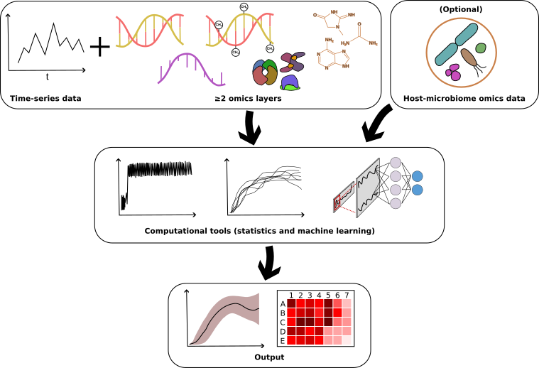

# Multi-omics time series analysis in microbiome research: a systematic review

## Purpose of This Repository
Welcome to the **Multi-omics time series analysis in microbiome research: a systematic review**! This repository has been created to provide supplementary documents to be published in **Breifings in BioInformatics** journal. The purpose of this repository is to ensure **transparency, reproducibility, and accessibility** of all data, methodologies, and analyses used in the review process.

Here, you will find well-organized tables, repositories, and documentation related to different aspects of the systematic review. The repository is structured to facilitate collaboration and allow researchers to easily access relevant information based on their specific interests.

## Repository Structure
The repository consists of multiple folders, each dedicated to a different scope of information related to the systematic review:

### 1. **Literature Search ("/literature_search")**
   - Contains search strategies, keywords, and databases used for retrieving relevant studies.
   - Includes details on inclusion/exclusion criteria and PRISMA flowchart.
   
### 2. **Screening & Data Extraction ("/screening_data_extraction")**
   - Includes screening forms, data extraction templates, and guidelines.
   - Provides summaries of extracted data from selected studies.
   
### 4. **Analysis & Results ("/analysis_results")**
   - Detailed tables providing information about the samples, time-series, multi-omics data, Statistical methods, ML and scope of the journals studies published.
   
### 6. **References & Citation Management ("/references")**
   - Bibliographic databases, citation files (BibTeX), and reference management details.

## Contact & Acknowledgments
For inquiries or collaborations, please reach out to the repository maintainer:

**[Moiz Khan Sherwani]**  
[moiz.sherwani@sund.ku.dk]  
[Globe Institute, University of Copenhagen]  

---
